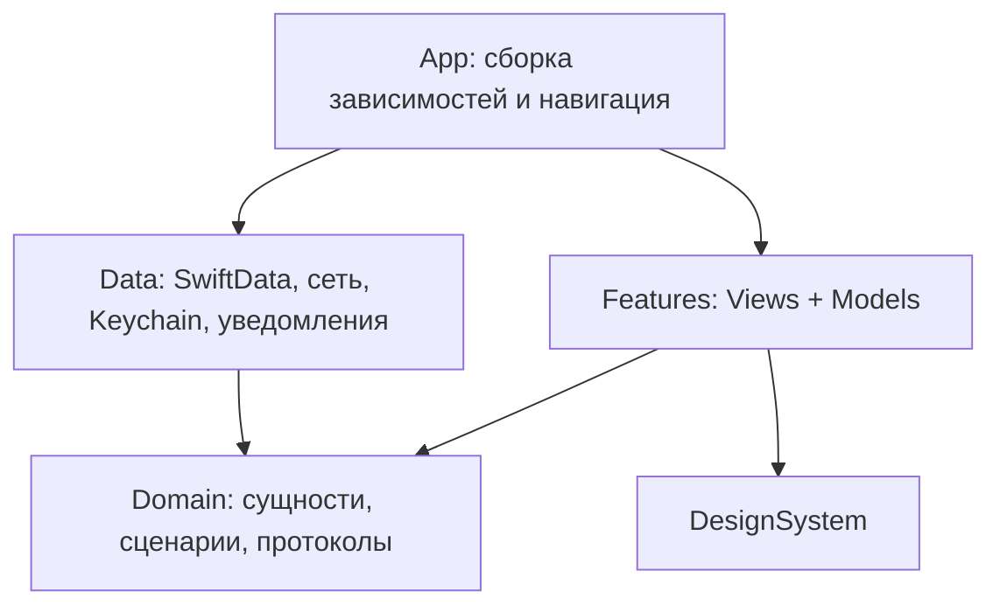

# Архитектура iOS-приложения

## Базовое решение

Модульный монолит: один iOS target с папками по функциям, небольшим общим доменом и явными зависимостями. На первом этапе отдельные Swift Packages не нужны. При росте домен, дизайн-систему и адаптеры можно вынести в пакеты без переписывания сценариев.

| Задача | Выбор |
| --- | --- |
| Платформа | iPhone, deployment target iOS 18.6 |
| Интерфейс | SwiftUI, системные NavigationStack и TabView |
| Состояние экрана | Observation: @Observable, UI-состояние на @MainActor |
| Бизнес-правила | Чистые Swift-типы и небольшие сценарии использования |
| Постоянные данные | SwiftData за репозиториями, схема и миграции |
| Секреты | Keychain через отдельный адаптер |
| Сеть | URLSession, async/await, отмена запросов |
| Напоминания | UserNotifications, сначала локальные |
| Графики | Swift Charts при появлении реальной истории |
| Ресурсы | Asset Catalog, String Catalog, локальные JSON-моки |
| Зависимости | Предпочтительно системные; без DI-фреймворка на старте |

Точную версию Xcode и Swift закрепим при создании проекта. Все выбранные API проверяем относительно минимального target; новые возможности системы подключаем через availability и fallback. Не делаем базовый сценарий зависимым от системной AI-модели или конкретного поколения iPhone.

## Направление зависимостей



Domain не импортирует SwiftUI, SwiftData или SDK AI-поставщика. Views не выполняют HTTP-запросы и не выбирают упражнения. Data реализует интерфейсы Domain. Только App знает конкретные реализации и подставляет mock/live через инициализаторы.

Состояние представления локально экрану; не создаём один огромный глобальный AppState. Общими являются активный профиль, настройки и маршрут приложения. Изменения сохранённых данных экраны получают через согласованный механизм обновления репозитория или явную перезагрузку после успешной операции.

## Реализованная структура (1 октября 2026)

Исходники приложения — около 10,7 тыс. строк Swift, тесты — около 1,9 тыс. строк (Swift Testing, 167 тестов в 11 наборах, все прошли в симуляторе iPhone 18 Pro).

```text
Packages/
  FelixGlass/      Локальный Swift-пакет: стекло (поверхность, кнопки, переключатель, панель вкладок, лист),
                   без зависимости от приложения; цвета приходят через environment
MaestroFelix/
  App/             Точка входа, AppDelegate, маршрут уведомления (AppRouter)
  DesignSystem/    FelixTheme, FelixControls, FelixComponents, FelixMotion; стекло берёт из FelixGlass
  Domain/          Чистые типы без SwiftUI и SwiftData: DayKey, TrainingCalendar, Schedule,
                   Progress, BodyWeight, Coach, Reminders, Workout, WorkoutPlanner,
                   ExerciseInfo, OnboardingProfile, DocumentStore (протокол хранилища)
  Data/            ProfileStore (SwiftData, ключ → JSON), NotificationScheduler (UserNotifications)
  Features/
    App/           AppCoordinator, MainTabView и модели: Schedule, Weight, Coach, Progress, Reminders
    Onboarding/    Анкета из семи шагов
    Today/ Plan/ Progress/ Profile/    Четыре вкладки
    Workout/       Сессия, модель журнала, ввод подхода, карточка техники, оценка, итог
  Resources/       Ассеты, PrivacyInfo.xcprivacy
MaestroFelixTests/ Домен, модели, хранилище, сквозные сценарии координатора
```

Отличия от проектной структуры ниже: нет отдельных папок UseCases, Contracts, Repositories и Planning; контракты — небольшие протоколы рядом с реализацией (`DocumentStore`, `NotificationScheduling`), планировщик лежит в `Domain`. Сети, Keychain, AI-адаптеров и UI-тестов пока нет. Слой Data реализует протоколы Domain, а Domain не импортирует SwiftUI и SwiftData; в тестах хранилище и планировщик уведомлений заменяются подставными.

**Координатор.** `AppCoordinator` (`@Observable`, `@MainActor`) объединяет модели и оркестрирует события: сохранение профиля пересчитывает расписание, завершение тренировки обновляет статистику, достижения и напоминания, удаление данных очищает хранилище и уведомления. Каждая модель владеет одним документом хранилища и может быть проверена отдельно; координатор даёт `settle()`, чтобы тесты дожидались фоновых задач.

## Предлагаемая структура исходников

Структура ниже проектная и описывает целевое состояние; реальная — выше.

```text
MaestroFelix/
  App/                     App entry, AppDependencies, AppRouter
  DesignSystem/            Tokens, Components, Theme
  Domain/
    Models/                Profile, Schedule, Plan, Session, Coach
    UseCases/              CompleteOnboarding, BuildWeek, RescheduleSession
    Contracts/             Repositories, PlanGenerator, CoachService
  Features/
    Onboarding/
    Today/
    Schedule/
    Coach/
    WorkoutDetail/
    WorkoutSession/
    Progress/
    Profile/
    Settings/
  Data/
    Persistence/           SwiftData records, mapping, schema migrations
    Repositories/
    Planning/              MockPlanGenerator; позднее RuleBasedPlanGenerator
    AI/                    Mock, Managed, ClaudeBYOK adapters
    Notifications/
    Security/
  Resources/               Assets, Localizable, Fixtures
MaestroFelixTests/           Будущие проверки доменных правил
MaestroFelixUITests/         Будущие основные пользовательские сценарии
```

Внутри функции достаточно View, Model и вложенных компонентов. Не создавать протокол для каждого класса или сценарий для простого чтения поля. Отдельные контракты оправданы на границах хранения, внешних сервисов, времени и заменяемого планирования.

## Ключевые контракты

- ProfileRepository: загрузить профиль, сохранить черновик, завершить онбординг.
- ScheduleRepository: читать правила недели и сохранять новую ревизию расписания.
- PlanGenerator: получить PlanningInput и вернуть кандидат WeeklyPlan либо структурированную причину невозможности.
- PlanRepository: сохранить версию плана, прочитать активную, атомарно активировать замену.
- SessionRepository: сохранить выполнение и незавершённую сессию; завершение идемпотентно.
- CoachService: сформировать сообщение по ограниченному CoachContext; не изменяет план.
- NotificationScheduler: согласовать желаемые напоминания с системными запросами.
- CredentialStore: сохранить, получить, удалить ключ; не возвращает его в UI-состояние.
- Clock: текущее время; CalendarPolicy: правила локального дня, недели и часового пояса.

## Поток данных

Нажатие → метод Model → сценарий → контракт → адаптер → результат → новое UI-состояние. Сохранение подтверждается только после успеха репозитория. Ошибка записи не должна выглядеть как успешное завершение тренировки.

SwiftData-модели остаются внутри persistence-слоя. Через конкурентные границы передаются value types / Sendable DTO; один ModelContext не разделяется произвольно между задачами. Сетевые задачи отменяются при смене контекста. Повторный запрос не создаёт дубликат плана или завершения занятия.

У экрана явно описаны loading, content, empty и error, где они нужны. Сбой AI не блокирует локальный экран. При ошибке миграции сохраняем пользовательскую базу и показываем восстановимый сбой; автоматическое удаление базы запрещено.

## Навигация

Первый запуск → онбординг → основная оболочка. Четыре вкладки: **Сегодня, План, Прогресс, Профиль**. Тренер доступен с главной и из профиля, выполнение занятия открывается отдельным потоком. Это освобождает нижнюю панель от будущего каталога, которого пока нет.

Deep link уведомления содержит sessionID. Если занятие уже завершено, открывается результат; если перенесено — актуальное занятие; если удалено — План с понятным сообщением. До завершения онбординга маршрут откладывается.

## Источники

Выбор слоёв — проектное решение. Поведение платформенных механизмов сверено 28.09.2026: [Observation в SwiftUI](https://developer.apple.com/documentation/SwiftUI/Managing-model-data-in-your-app), [SwiftData](https://developer.apple.com/documentation/swiftdata/), [локальные уведомления](https://developer.apple.com/documentation/usernotifications/scheduling-a-notification-locally-from-your-app). Это не заменяет будущую проверку сборки на минимальной ОС.

## Расширение после MVP: живые тренеры

CoachPersona и CoachService описывают виртуального помощника. Реальный тренер — Account с ролью trainer, связанный с клиентом через TrainerClientRelationship. Не используем selectedCoachID для обоих значений; в MVP называем выбор персонажа selectedPersonaID.

В MVP сохраняем стабильные идентификаторы профиля, авторство/происхождение контента и snapshots. Не привязываем репозитории к глобальному «единственному пользователю»: операции явно относятся к profileID. Одного локального профиля для интерфейса достаточно, таблицы аккаунтов и серверную авторизацию реализуем после MVP.

Будущие функции: Identity, TrainerWorkspace, ClientRelationships, ContentLibrary, Assignments. Адаптеры: RemoteRepositories, SyncEngine, ImportService. Контракты добавляем вместе с реализацией функций. Приложение собирает разные маршруты для ролей; права на данные проверяет сервер.

Назначение тренера поступает через AssignmentRepository и переводится в существующий PlannedSession; PlanGenerator его не создаёт и не переписывает. Локальный журнал выполнения используется повторно. При регистрации пользователь явно связывает свою локальную историю с аккаунтом, миграция сохраняет ID и не объединяет автоматически записи разных владельцев.

Полный поток, конфликты и правила доступа: [тренеры и клиенты](../features/trainer-clients.md).
